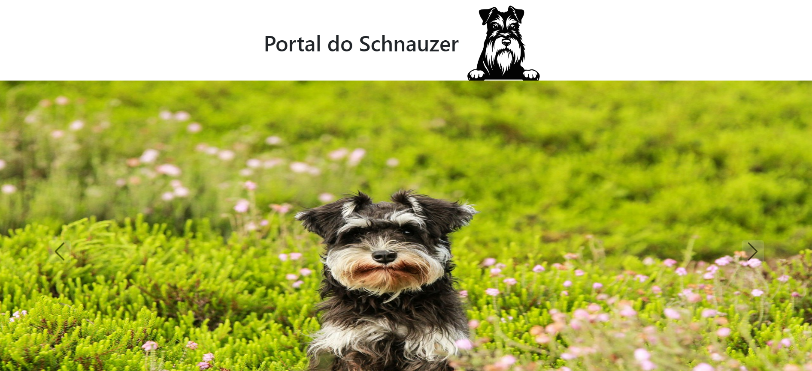
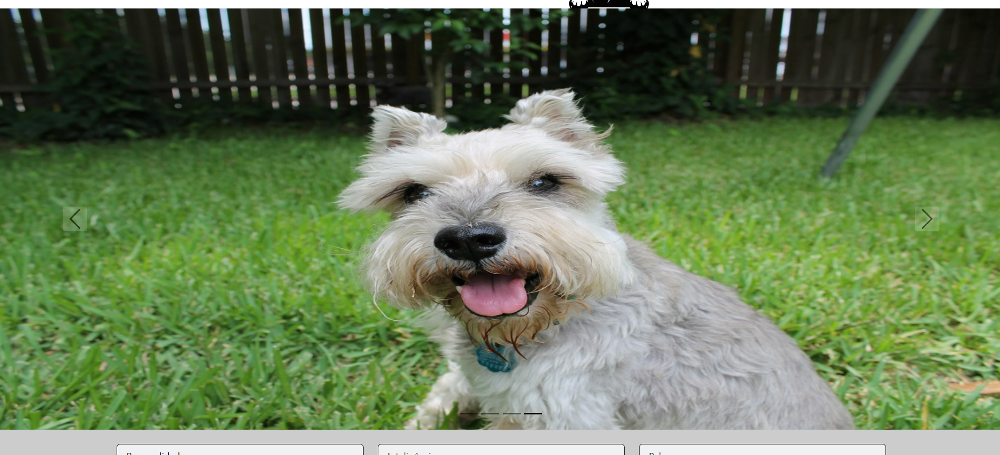
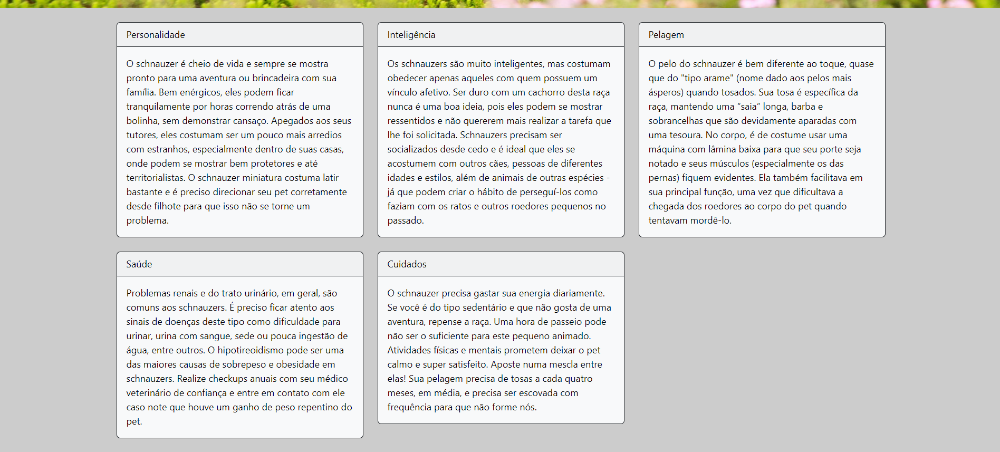

# Schnauzer info site with Bootstrap


This application explores the use of Bootstrap to build a responsive web page, with the display of an image carousel, and information cards.

## Index
- <a href="#functionalities">Application functionalities</a>
- <a href="#layout">Layout</a>
- <a href="#demonstration">Demonstration</a>
- <a href="#run">How to run the application</a>
- <a href="#tecnologies-used">Tecnologies used</a>
- <a href="#developer">Developer</a>

## Application functionalities
 - [x]  Image carousel
 - [x]  Responsive layout for different screen sizes

## Layout




## Demonstration
[Link (deploy)](https://portal-do-schnauzer.vercel.app/)


## How to run the application
```bash
# Clone this repository
$ git clone repolink

# Acess the app folder on your terminal
$ cd cards-carousel-bootstrap

# Utilize a local server launch tool to view the application in your browser

```

## Tecnologies used
1. HTML
2. CSS
3. Bootstrap

## Developer
[LinkedIn](https://www.linkedin.com/in/julia-silva-borges/)
